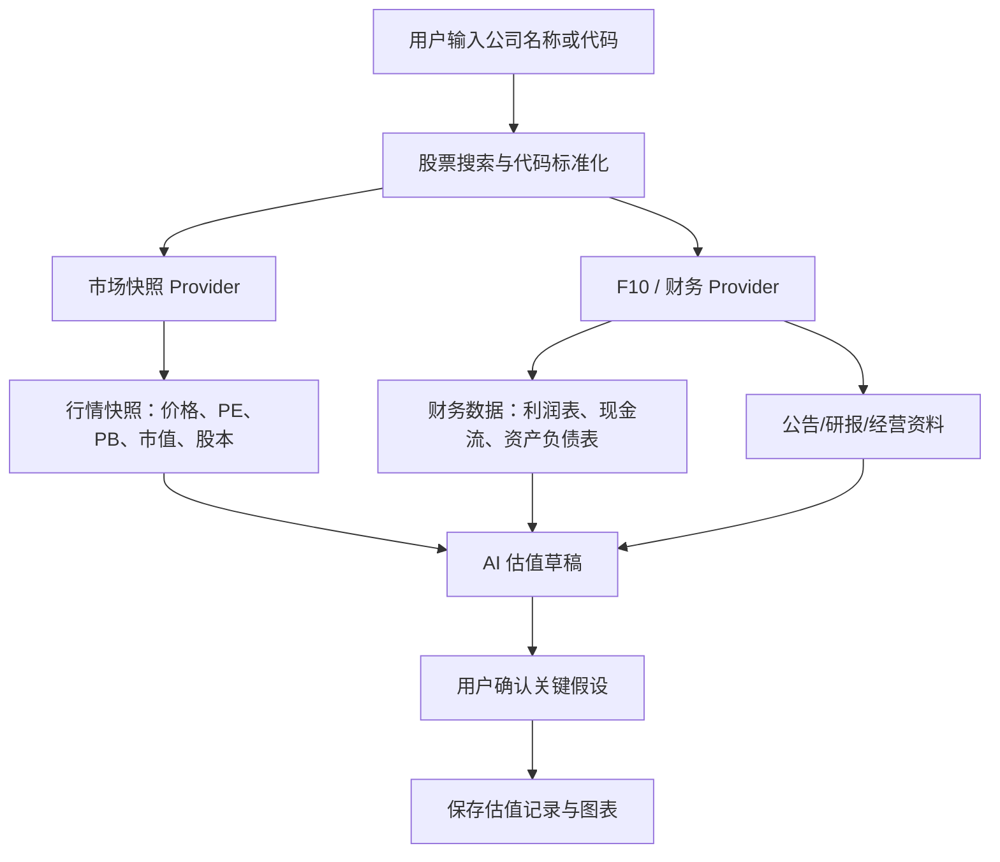

# jcp 行情与公司数据接口评估

更新时间：2026-05-04

## 结论

`jcp` 项目中的数据接口可以满足 Value Compass 的第一阶段“公司行情快照”和“估值基础输入”需求，但不能单独满足完整的价值投资研究档案需求。

推荐采用方式：

1. 不直接复制 Go 服务到 Next.js 主应用。
2. 先提取接口契约和字段模型，在 Value Compass 中实现 TypeScript 数据源适配层。
3. P1 优先接入东方财富 F10/估值快照，用于当前价、PE TTM、PB、市值、股本等估值输入。
4. TDX / 新浪行情作为后续可选行情源或兜底源，不作为价值投资估值的唯一数据依据。
5. 财报、公告、研报、经营数据必须带来源、日期、缓存时间和“待用户确认”状态。

## 已识别的 jcp 数据源

| 模块 | 文件 | 数据源 | 主要用途 |
| --- | --- | --- | --- |
| 行情服务 | `jcp/internal/services/market_service.go` | TDX 主源 + 新浪兜底 | 实时行情、K 线、指数、公告 |
| 行情 Provider | `jcp/internal/services/market_provider.go` | 抽象 provider | 主源/兜底源切换 |
| TDX Provider | `jcp/internal/services/market_provider_tdx.go` | `github.com/injoyai/tdx` | 实时行情、五档盘口、K 线、股票搜索 |
| F10 服务 | `jcp/internal/services/f10_service.go` | 东方财富 F10 / DataCenter | 公司资料、财务报表、估值、行业对比、公告等 |
| 股票模型 | `jcp/internal/models/stock.go` | 本地模型 | 股票、K 线、盘口、指数 |
| F10 模型 | `jcp/internal/models/f10.go` | 本地模型 | 财务、估值、行业、经营、管理层等 |
| Wails 桥接 | `jcp/app.go` | 前端调用入口 | 暴露 GetStockRealTimeData / GetF10Valuation 等方法 |

## 可提取 API 清单

### 1. 股票实时行情

jcp 方法：

- `GetStockRealTimeData(codes ...string)`
- `GetStockDataWithOrderBook(codes ...string)`

可返回字段：

- 股票代码
- 公司名称
- 当前价
- 涨跌额
- 涨跌幅
- 成交量
- 成交额
- 开盘价
- 最高价
- 最低价
- 昨收价
- 五档盘口

对 Value Compass 的适配价值：

- 可用于观察池当前价格展示。
- 可用于估值记录中的“当前市场价格”自动填充。
- 可用于安全边际计算：当前价 vs 三情景内在价值。

限制：

- 这是行情数据，不是价值判断。
- 不能直接用于生成买入/卖出建议。
- 五档盘口和分钟级价格对价值投资主流程优先级较低。

### 2. K 线数据

jcp 方法：

- `GetKLineData(code string, period string, days int)`

支持周期：

- `1m`
- `1d`
- `1w`
- `1mo`

可返回字段：

- 时间
- 开盘价
- 最高价
- 最低价
- 收盘价
- 成交量
- 成交额
- 分时均价
- MA5 / MA10 / MA20

对 Value Compass 的适配价值：

- 可用于公司页展示价格历史。
- 可用于技术指标学习页面的示例数据。
- 可用于复盘“当时价格所处区间”，但不应作为核心价值判断。

限制：

- 技术指标只能作为辅助观察，不应覆盖价值投资主线。
- 如果未来开放给其他用户，K 线数据源稳定性、频率限制和版权边界需要单独评估。

### 3. 股票搜索

jcp 方法：

- `SearchStocks(keyword string, limit int)`

可返回字段：

- 股票代码
- 公司名称
- 行业
- 市场

对 Value Compass 的适配价值：

- 可用于用户输入公司名称/代码时自动补全。
- 可用于估值草稿、研究档案、观察池的公司选择入口。

推荐优先级：

- 高。

原因：

- 用户当前痛点是估值填写复杂，自动识别公司是后续自动取数的第一步。

### 4. 东方财富估值快照

jcp 方法：

- `GetF10Valuation(code string)`
- `GetValuationByCode(code string)`

数据源：

- `https://push2.eastmoney.com/api/qt/stock/get`

字段：

- 当前价
- PE TTM
- PB
- 总市值
- 流通市值
- 换手率
- 振幅
- 总股本
- 流通股本

对 Value Compass 的适配价值：

- 非常适合第一版估值自动填充。
- 可直接补齐估值模型所需的基础市场数据。
- 对 PE、PB、股息率、分部估值等模板都有辅助价值。

推荐优先级：

- 最高。

建议用途：

- `marketSnapshot.price`
- `marketSnapshot.peTtm`
- `marketSnapshot.pb`
- `marketSnapshot.totalMarketCap`
- `marketSnapshot.floatMarketCap`
- `marketSnapshot.totalShares`
- `marketSnapshot.floatShares`
- `marketSnapshot.asOf`
- `marketSnapshot.source = eastmoney`

### 5. F10 财务报表

jcp 方法：

- `GetFinancialStatements`

数据源：

- 东方财富 F10 / DataCenter

覆盖范围：

- 利润表
- 资产负债表
- 现金流量表

对 Value Compass 的适配价值：

- 可以为 DCF、股息折现、资产价值、周期股估值提供基础数据。
- 可辅助生成“公司研究档案”中的财务质量部分。

限制：

- 字段是东方财富接口原始字段，需要二次标准化。
- 需要明确报告期、合并口径、单位、是否调整。
- 关键研究结论仍建议用户核对公司公告和年报。

### 6. 公告与研报

jcp 已包含：

- 个股公告摘要
- F10 研究报告列表
- 部分公告、业绩预告、业绩快报、分红融资等事件数据

对 Value Compass 的适配价值：

- 可用于 AI 生成研究档案草稿时提供证据。
- 可用于“关键假设持续验证”提醒。
- 可用于复盘时检查假设是否被事实推翻。

限制：

- 公告摘要不等于公告全文。
- 研报预测必须标记来源和日期，不能作为确定事实。
- 用户确认前，不应自动写入最终估值记录。

## 与 Value Compass 需求的匹配度

| 我们的需求 | jcp 能否满足 | 评估 |
| --- | --- | --- |
| 输入公司名/代码后识别股票 | 基本满足 | 可复用股票搜索和代码标准化逻辑 |
| 获取当前价格 | 满足 | TDX / 新浪 / 东方财富均可实现 |
| 获取 PE、PB、市值、股本 | 满足 | 东方财富估值快照最匹配 |
| 获取 K 线和均线 | 满足 | 适合技术指标教学和价格历史展示 |
| 获取完整财报数据 | 部分满足 | 有 F10 报表接口，但需标准化和校验 |
| 自动生成三情景估值参数 | 部分满足 | 能给历史数据，不能自动保证假设质量 |
| 自动生成公司研究档案 | 部分满足 | 可提供素材，仍需 AI 整理和用户确认 |
| 获取真实公告证据 | 部分满足 | 有公告摘要，全文/PDF 需要进一步接入 |
| 投资建议 | 不应该满足 | 产品原则是不输出买入建议 |

## 推荐架构



建议新增统一接口：

```ts
export type CompanyDataProvider = {
  searchStocks(keyword: string): Promise<StockSearchResult[]>;
  getMarketSnapshot(symbol: string): Promise<MarketSnapshot>;
  getFinancialStatements(symbol: string): Promise<FinancialStatements>;
  getAnnouncements(symbol: string): Promise<AnnouncementSummary[]>;
  getValuationSnapshot(symbol: string): Promise<ValuationSnapshot>;
};
```

所有 provider 返回数据时必须包含：

- `source`
- `sourceUrl`
- `asOf`
- `fetchedAt`
- `stale`
- `raw`
- `normalized`
- `warnings`

## 推荐接入顺序

### P1-1：股票搜索与代码标准化

目标：

- 用户输入“美的集团”或“000333”时自动识别为 `000333.SZ` / `sz000333`。

实现建议：

- 先使用本地股票基础列表或东方财富搜索。
- 保留 `rawCode`、`exchange`、`normalizedSymbol` 三个字段。

### P1-2：估值快照

目标：

- 自动填充当前价、PE TTM、PB、总市值、流通市值、总股本。

优先数据源：

- 东方财富 `quoteDataURL`。

适用页面：

- `/valuations`
- `/watchlist`
- 公司研究档案页

### P1-3：AI 估值草稿输入助手

目标：

- 用户输入公司后，系统拉取行情和基础估值指标。
- AI 根据估值模板生成悲观/中性/乐观草稿。
- 用户必须手动确认关键假设后才能保存。

关键限制：

- 不输出“买入建议”。
- 只输出“估值区间、假设、风险、待验证事项”。

### P1-4：财报数据标准化

目标：

- 将东方财富 F10 报表字段映射到 Value Compass 内部字段。

需要处理：

- 单位统一。
- 报告期统一。
- 年报/季报口径。
- 缺失字段。
- 现金流质量、ROIC、毛利率、净利率等派生指标。

### P1-5：公告与证据链

目标：

- 公司研究档案中的关键结论必须能追溯到公告、财报或研报来源。

建议：

- 先做公告摘要和链接。
- 后续再做公告全文/PDF 解析。

## 风险与边界

1. 数据源不是官方授权 API

TDX、Sina、东方财富网页接口都属于非正式公开接口，可能变更字段、限流或不可用。

2. 数据不能直接成为投资结论

行情和 F10 数据只能用于辅助研究，必须经过用户确认和 AI 反方审查。

3. 财报字段需要严肃标准化

不同接口中的金额单位、报告期、字段命名可能不一致。不能直接把原始字段喂给估值模型。

4. 需要缓存和降级策略

行情快照可以短缓存；财报、公告、研究档案素材可以长缓存。接口失败时应展示最后更新时间和失败原因。

5. 开放给其他人使用前需要合规说明

需要明确：

- 数据来源
- 数据延迟
- 不保证准确性
- 不构成投资建议
- 用户应核对上市公司公告

## 最终建议

jcp 的行情接口可以作为 Value Compass 的数据接入参考，但第一版不建议完整迁移 TDX + 新浪行情栈。

更稳妥的路线是：

1. 先接东方财富估值快照，解决估值页最痛的自动填充问题。
2. 再接股票搜索，降低用户输入成本。
3. 再接 F10 财报和公告，支撑标准化公司研究档案。
4. 最后再考虑 K 线、技术指标和 TDX 行情源。

这条路线与 Value Compass 的核心目标更一致：不是做交易终端，而是帮助用户从公司、财务、估值、假设和纪律出发，搭建自运行投资系统。
